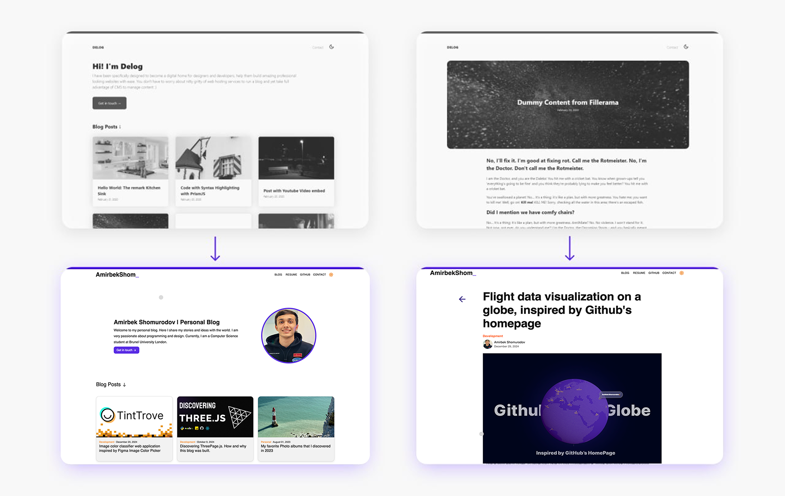
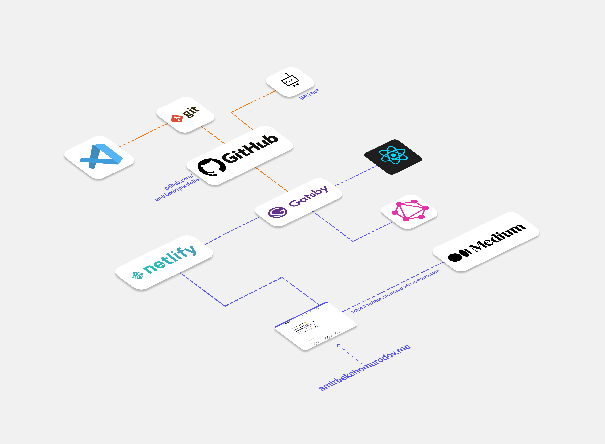

## Why would I need a blog?

The idea of building my own website wasn’t something that came out of the blue. It’s been on my mind for a couple of years now, gradually taking shape as I thought more about what I truly needed. One of the main reasons for this decision is my relationship with language. While Uzbek is my native language, I’ve always found expressing complex thoughts in English to be more natural for me. However, it’s not without challenges—especially when it comes to speaking. I’ve worked hard to improve my English, and although I’ve made significant progress, it’s still not where I want it to be. On the other hand, I’ve realized that coding languages are where I can truly shine. I feel more comfortable expressing myself through code than through spoken words.

That’s where the idea of a website comes in. A personal website would allow me to showcase my skills, projects, and experiences in a way that feels authentic and doesn’t rely on how well I can speak or explain things verbally. It’s also a space where I can focus on what matters most: sharing my work, growing as a developer, and giving people a glimpse of what I can do.


I’ve thought about using social media platforms like Instagram or Twitter for this purpose, but they’ve never felt right for me. Social media often feels distracting and, at times, toxic. It’s easy to get caught up in the endless scrolling, and I’ve realized I’d rather spend my time building something meaningful than chasing likes or views. A website, on the other hand, is independent—it’s my space to design, refine, and perfect. It’s also a great way to stand out when applying for jobs or connecting with companies.


## How it was built?
The initial plan was to build a typical MERN stack application. I proceeded coding with React until I stumbled upon [Gatsby.js](http://url.com). I remember a friend of mine showed me what Gatsby.js is, but I never took the opportunity to learn it. From the first glance, Gatsby.js looked like a very promising framework that could possibly be popular in the future. It was offering better efficiency by pre-building static pages out of your React application. Plus, the process of converting your React application into Gatsby seemed to be very smooth and easy with minimal structure alteration.

Once I was familiar with Gatsby's documentation, I have started building my blog on top of an existing template that they were offering on their website. You can actually try it yourself by running these scripts below:

```bash
npm install --save gatsby
gatsby new gatsby-starter-delog https://github.com/W3Layouts/gatsby-starter-delog
```


## Design Improvements

The default template was looking pretty good, however, it was plain. I especially did not like the typography spacing: margins between different text sizes were the same, which was kind of odd for a text-rich website. Instead, I used 24px spacing baseline that I successfully tested on a website I did for a start-up this summer. The idea is pretty simple: spacing increases incrementally depending on the element hierarchy, giving my text a consistent look and better readability.

```css
--baseline: 24px;
--space-sm: calc(var(--baseline) / 2);
--space-md: var(--baseline);
--space-lg: calc(var(--baseline) * 2);
--space-xl: calc(var(--baseline) * 3);
```



I also added my own touch to the overall design of the website. I tried to use Material UI React along the way, as I was getting more confident with it. Additionally, I changed the GraphQL schema to include a flair (e.g. development, personal, academic, etc.) of the post for better visual navigation.


To make things easier, here is a structure of my blog that is portrayed in the highest level of abstraction possible, while retaining the overall logic.

By the way, if you are a student, you can get a discount on a domain name just like I did on [Namecheap.com](https://www.namecheap.com) using [GitHub Student Developer Pack](https://education.github.com/pack).
