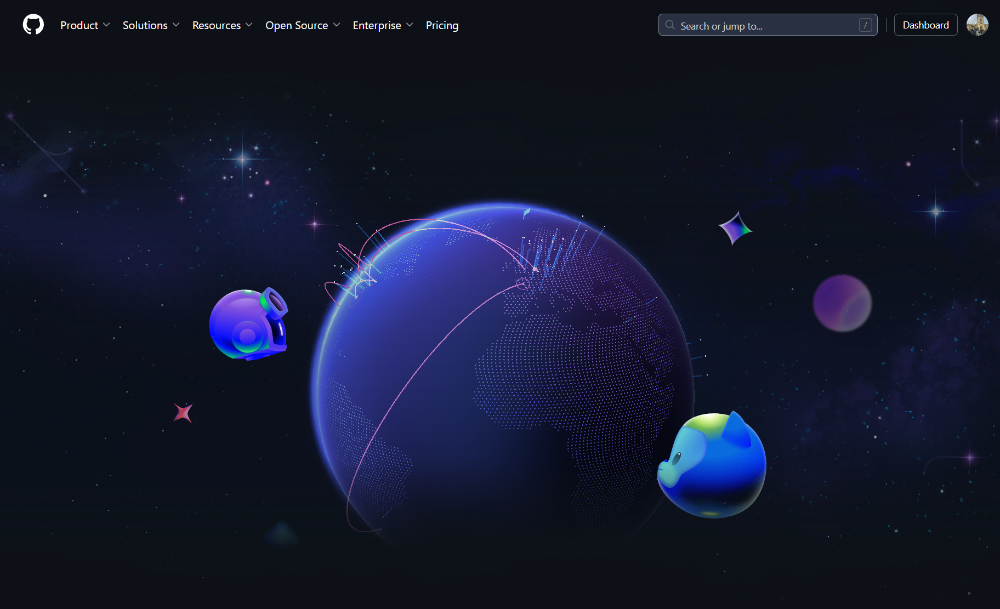
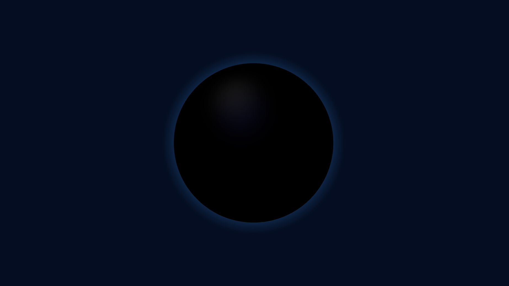

### Inspiration
If you visited [Github's homepage](https://github.com/home) recently, you probably seen their new, re-designed landing page. It is incredibly well-made. One thing that stands out is the globe, where they display recent pull request activity on Github. It is fascinating to see 3D becoming more and more popular in web design.
 
**I wanted to re-create it.**

### Three-Globe

Doing a Portal Scene with in R3F and Three.js from scratch really helped me to familiarize myself with ThreeJS concepts. At first, I did not have any idea where to start. Luckily, I found a package named **three-globe** that allows users to display data on a globe. It had a pretty well-written documentation too. However, it was ugly and nowhere near to the globe design made by Github


### Creating an environment

After extensive testing with various lighting setups, I successfully recreated a dreamy space environment using four distinct light sources. An **Ambient Light** bathes the entire scene in a gentle, diffuse glow, enhancing the soft exposure of the globe. Above the globe, a **Directional Light** casts a strong, focused illumination on the upper hemisphere, highlighting its features. Additional depth and texture are provided by two colored **Directional Lights**, which add nuanced shading. A **Point Light** is strategically placed to introduce realistic shadows, further enhancing the visual complexity and realism of the globe.

```javascript
// Lights setup
const ambientLight = new THREE.AmbientLight(0xbbbbbb, parameters.ambientLightIntensity);

const directionalLight = new THREE.DirectionalLight(0xffffff, parameters.directionalLightIntensity);
directionalLight.position.set(parameters.lightPositionX, parameters.lightPositionY, parameters.lightPositionZ).normalize();
directionalLight.castShadow = true;

const directionalLight2 = new THREE.DirectionalLight(0xffffff, parameters.directionalLightIntensity);
directionalLight2.position.set(-parameters.lightPositionX, parameters.lightPositionY, parameters.lightPositionZ).normalize();

const pointLight = new THREE.PointLight(0x8566cc, parameters.pointLightIntensity);
pointLight.position.set(-400, 500, 200);
```


### Displaying my boarded flights from 2022-2023

The source code is available on the [amirbeek/github-globe-visualization](https://github.com/Amirbeek/github-globe-visualization) repository. This visualization displays all my flights from 2022 to 2023 on a globe, using data retrieved from my Google Calendar. It looks cool, but there are still many aspects to refine. The project is deployed on Vercel and can be viewed here: [GitHub Flight Visualization](https://github-globe-visualization.vercel.app/).

